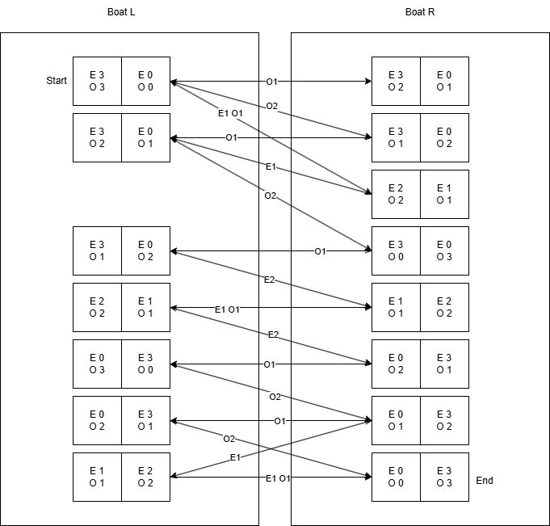

# Tasks

## 1

### 1.1

#### States

| Left side      | Right Side     | Horse |
| -------------- | -------------- | ----- |
| 3 Orcs 3 Elves | 0 Orcs 0 Elves | L     |
| 2 Orcs 2 Elves | 1 Orcs 1 Elves | L     |
| 1 Orcs 1 Elves | 2 Orcs 2 Elves | L     |
| 2 Orcs 3 Elves | 1 Orcs 0 Elves | L     |
| 1 Orcs 3 Elves | 2 Orcs 0 Elves | L     |
| 3 Orcs 0 Elves | 0 Orcs 3 Elves | L     |
| 2 Orcs 0 Elves | 1 Orcs 3 Elves | L     |
| -------------- | -------------- | ----- |
| 2 Orcs 2 Elves | 1 Orcs 1 Elves | R     |
| 1 Orcs 1 Elves | 2 Orcs 2 Elves | R     |
| 0 Orcs 0 Elves | 3 Orcs 3 Elves | R     |
| 2 Orcs 3 Elves | 1 Orcs 0 Elves | R     |
| 1 Orcs 3 Elves | 2 Orcs 0 Elves | R     |
| 0 Orcs 3 Elves | 3 Orcs 0 Elves | R     |
| 1 Orcs 0 Elves | 2 Orcs 3 Elves | R     |
| 2 Orcs 0 Elves | 1 Orcs 3 Elves | R     |

#### Actions

- Transfer from L to R:
  - 1 Elf
  - 1 Orc
  - 1 Orc and 1 Elf
  - 2 Orcs
  - 2 Elfs
- Transfer from R to L:
  - 1 Elf
  - 1 Orc
  - 1 Orc and 1 Elf
  - 2 Orcs
  - 2 Elfs

#### Start-State

| Left side      | Right Side     |
| -------------- | -------------- |
| 3 Orcs 3 Elves | 0 Orcs 0 Elves |

#### End-State

| Left side      | Right Side     |
| -------------- | -------------- |
| 0 Orcs 0 Elves | 3 Orcs 3 Elves |

### 1.2

## 2

| Stadt     | Kürzel  | h(n)|
| -----     | ------  | --- |
| Frankfurt | F       | 100 |
| Mannheim  | MA      | 200 |
| Würzburg  | W       | 170 |
| Stuttgart | S       | 300 |
| Kassel    | K       | 460 |
| Karlsruhe | KA      | 10  |
| Erfurt    | E       | 400 |
| Nürnberg  | N       | 537 |
| Augsburg  | A       | 0   |
| München   | M       | 0   |

### Tiefensuche

| Schritt | Stack          |
| ------- | -------------- |
| 1       | W              |
| 2       | E, F, N        |
| 3       | E, F, M, S     |
| 4       | E, F, M        |

-> Found!

### Breitensuche

| Schritt | Queue       |
| ------- | -----       |
| 1       | W           |
| 2       | E, F, N     |
| 3       | F, N        |
| 4       | N, K, MA    |
| 5       | K, MA, M, S |
| 6       | MA, M, S    |
| 7       | M, S, KA    |

-> Found!

### A*

| Schritt | Open List                           | Closed List             |
| ------- | ----------------------------------- | ----------------------- |
| 1       | **W(0)**                            |                         |
| 2       | E(586), **F(317)**, N(640)          | W                       |
| 3       | E(586), N(640), **MA(502)**, K(850) | W, F                    |
| 4       | E(586), N(640), K(850), **KA(392)** | W, F, MA                |
| 5       | **E(586)**, N(640), K(850), A(632)  | W, F, MA, KA            |
| 6       | N(640), K(850), **A(632)**          | W, F, MA, KA, E         |
| 7       | **N(640)**, K(850), M(716)          | W, F, MA, KA, E, A      |
| 8       | K(850), S(486), **M(270)**          | W, F, MA, KA, E, A, N   |

-> Found!

### Algorithmenvergleich

- Tiefensuche
  - MaxStack: 4
  - Schritte: 4
- Breitensuche
  - MaxQueue: 4
  - Schritte: 7
- A*
  - MaxOpenList: 4
  - MaxClosedList: 7
  - Schritte: 8

### Verwendung für A* Valide

Die gegebenen Abschätzungen dürfen nicht für A* verwendet werden. Als einfaches Beispiel kann man hier die Restkosten für Nürnberg nehmen.
Nürnberg liegt, gemessen anhand der Autobahnen nicht mal 200 Kilometer von München entfernt, ist jedoch mit 537 km angegeben. Außerdem liegt Nürnberg auf ca. der Mitte der Strecke von Frankfurt nach München, was das ganze noch anschaulicher macht, da Frankfurt mit untertriebenen 100 km angegeben ist.

Da 537 km den tatsächlichen Wert überschätzt ist die Heuristik nicht gültig und der Algorithmus nicht mehr optimal.

### Neuer Durchlauf von A*

Neue Werte: (Abrundungen der Luftlinien)

| Stadt     | Kürzel  | h(n)|
| -----     | ------  | --- |
| Frankfurt | F       | 306 |
| Mannheim  | MA      | 272 |
| Würzburg  | W       | 219 |
| Stuttgart | S       | 190 |
| Kassel    | K       | 383 |
| Karlsruhe | KA      | 252 |
| Erfurt    | E       | 318 |
| Nürnberg  | N       | 150 |
| Augsburg  | A       | 56  |
| München   | M       | 0   |

| Schritt | Open List                           | Closed List             |
| ------- | ----------------------------------- | ----------------------- |
| 1       | **W(0)**                            |                         |
| 2       | E(504), F(523), **N(153)**          | W                       |
| 3       | E(504), F(523), S(476), **M(270)**  | W, N                    |

-> Found!

- MaxOpenList: 4
- MaxClosedList: 2
- Schritte: 3

## 3

Eine Heuristik h1 dominiert eine andere Heuristik h2, wenn die geschätzten Werte für alle Knoten von h1 größer sind als die von h2 und die Heuristik trotzdem zulässig ist.

Nutzt man eine dominantere Heuristik gegenüber einer weniger dominanten Heuristik, sind die Schätzungen genauer und A\* insgesamt schneller.

Nimmt man als Beispiel das Finden eines Optimalen Weges von einer Stadt zur anderen, so wäre eine Heuristik h1 dominierend im Vergleich zu einer Heuristik h2, wenn alle Werte in h1 näher an der Luftlinie zwischen dem aktuellen und Zielknoten sind.

## 4

Angenommen beim Starten existieren zwei Knoten die beide Zielführend sind, Knoten K1 ist optimal und Knoten K2 ist suboptimal. Da wir annehmen das K2 suboptimal ist, werden die berechneten  Kosten für diesen Knoten höher sein als die optimalen, während die von K1 näher, bzw. auf dem Optimum liegen. Das heißt das die Kosten von K2 größer sind als K1. \
A\* ist ein informierter Suchalgorithmus. Die Funktionsweise gibt vor, dass zunächst der Kostengünstigere Knoten, in diesem Fall also K1, betrachtet wird. Das betrachten eines Knotens führt meist zum hinzufügen neuer zu betrachtender Knoten. Diesen wird erneut ein Wert zugeordnet, wodurch sich der zuvor genannte Prozess wiederholt und A\* erneut den optimaleren von beiden Knoten wählen wird. \
Im Verlauf der Berechnung können aber auch ältere Knoten, in diesem Fall z.B. K2 wieder in Betracht gezogen werden. Dadurch wird auch abgedeckt, dass ein zunächst vermeindlich optimaler Weg, welcher eigentlich suboptimal ist, erst nach einem tatsächlich optimalen untersucht wird. \
Nach Durchlauf des Algorithmus wird A\* aufgrund der zuvor genannten Aspekte immer einen optimalen Pfad vor einem suboptimalen gewählt haben. Das garantiert, dass ein optimaler Pfad immer zuerst gefunden wird, was den Algorithmus als optimal kennzeichnet.
