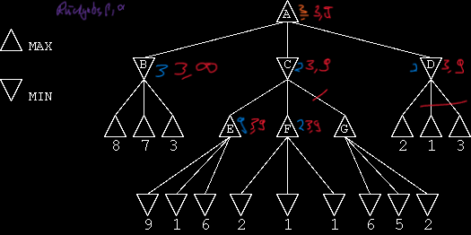
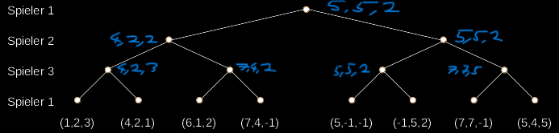

# Praktikum 3

## 1

### 1.1

A -> B -> **3**
A -> C -> F -> **2**
A -> D -> **1**

A = 3

### 1.2

### 1.3

Ein Knotentausch würde nichts bringen, da durch B und E alpha und beta gesetzt werden und F als erstes diese Grenzen ausnutzt. Jeder Knoten danach bricht auch durch die Festgelegten Grenzen direkt ab, also werden so wenige Knoten besucht wie nötig.

## 2

### 2.1

Besuchte Knoten: 549946

### 2.2

Besuchte Knoten: 30442

### 2.3

Der durch Alpha-Beta Pruning ergänzte Algorithmus braucht nur ein achtzehntel der besuchten Knoten um zu einem Ergebnis zu kommen.

In einem reelen Spiel würde man zu so einem Ergebnis gelangen, wenn man den Standartisierten Spielfluss mit einem X in der Mitte unterbricht und Stumpf entgegen der Erwartung des Gegners die obere Zeile belegt.

## 4

### Endzustände

x I o I  
--I---I--  
x I x I x  
--I---I--  
o I   I o

utility = 1

x I x I o  
--I---I--  
  I o I x  
--I---I--  
o I   I  

utility = -1

o I x I x  
--I---I--  
x I x I o  
--I---I--  
o I o I x  

utility = 0

### Zwischenstände

x I x I o  
--I---I--  
  I o I  
--I---I--  
  I   I  

utility = 3\*0 + 1 - (3\*1 + 1) = -3

x I x I  
--I---I--  
o I x I  
--I---I--  
  I   I o  

utility = 3\*2 + 1 - (3\*0 + 2) = 5

  I o I x  
--I---I--  
  I x I  
--I---I--  
o I x I o  

utility = 3\*0 + 1 - (3\*0 + 1) = 0

### Sinnvoll?

Eine Evaluierungsfunktion ist nützlich, da es Züge und Situationen gibt durch die oder in denen einer der Spieler einen klaren Vorteil gegenüber dem anderen hat.

## 5

