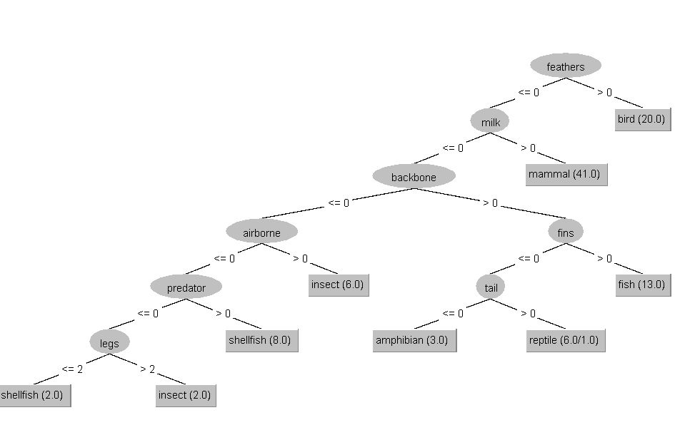
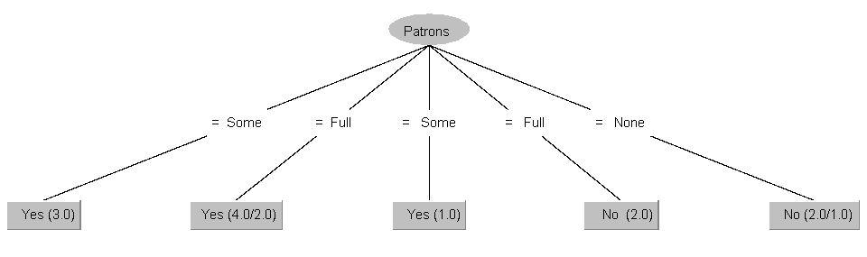
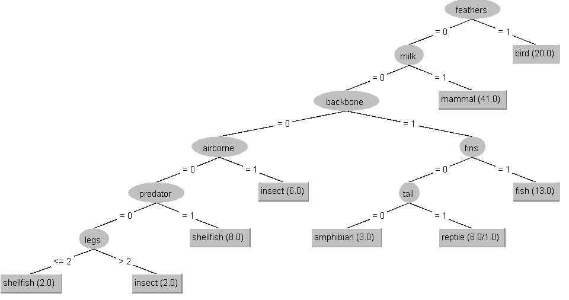
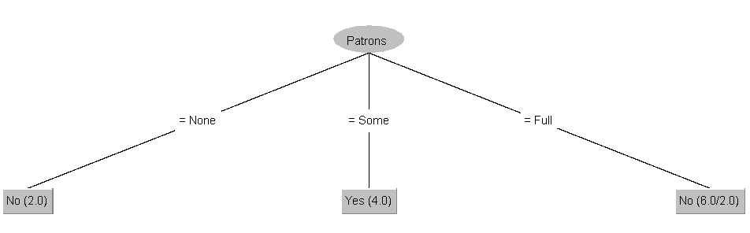
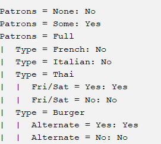

# Praktikum 4

## 1

### CAL3

$S_1 = 4, S_2 = 0.7$

Step | $\alpha$  | Rule  
---  | --------- | ---  
1    | $/O1/$  | 1  
2    | $/O2/$ | 2  
3    | $/O2M1/$ | 3  
4    | $/O2M2/$ | 4  
-- | -- | P(O) = 2/4 = 0,5, P(M) = 2/4 = 0,5
5    | $x_1(*, /M1/)$ | 4  
6    | $x_1(*, /O1M1/)$ | 5  
7    | $x_1(/O1/, /O1M1/)$ | 6  
8    | $x_1(/O1M1/, /O1M1/)$ | 7  
9    | $x_1(/O1M1/, /O2M1/)$ | 1  
10   | $x_1(/O2M1/, /O2M1/)$ | 2  
11   | $x_1(/O2M1/, /O2M2/)$ | 3  
-- | -- | P(O) = 2/4 = 0,5, P(M) = 2/4 = 0,5
12   | $x_1(/O2M1/, x_2(*, /M1/))$ | 3  
13   | $x_1(/O2M1/, x_2(/M1/, /M1/))$ | 4  
14   | $x_1(/O2M1/, x_2(/M1/, /O1M1/))$ | 5  
15   | $x_1(/O3M1/, x_2(/M1/, /O1M1/))$ | 6  
-- | -- | P(O) = 3/4 = 0,75, P(M) = 1/4 = 0,25
16   | $x_1(O, x_2(/M1/, /O1M1/))$ | 6  -> 2, 6 und 7 können übersprungen werden
17   | $x_1(O, x_2(/M1/, /O2M1/))$ | 1  
18   | $x_1(O, x_2(/M1/, /O2M2/))$ | 3  
-- | -- | P(O) = 2/4 = 0,5, P(M) = 2/4 = 0,5
19   | $x_1(O, x_2(/M1/, x_3(*, /M1/, *)))$ | 3  
20   | $x_1(O, x_2(/M2/, x_3(*, /M1/, *)))$ | 4  
21   | $x_1(O, x_2(/M2/, x_3(*, /M1/, /O1/)))$ | 5  
22  | $x_1(O, x_2(/M2/, x_3(/O1/, /M1/, /O1/)))$ | 1  
23   | $x_1(O, x_2(/M2/, x_3(/O1/, /M2/, /O1/)))$ | 3  
24   | $x_1(O, x_2(/M3/, x_3(/O1/, /M2/, /O1/)))$ | 4  
25   | $x_1(O, x_2(/M3/, x_3(/O1/, /M2/, /O2/)))$ | 5  

Füllen sich nur jeweils weiter auf...

$f(x) = $x_1(O, x_2(M, x_3(O, M, O)))$

### ID3

#### H(Wahl)

$v_1 = O, v_2 = M$  
$p_1 = 4/7 = 0.57, p_2 = 3/7 = 0.43$  
$H(Wahl) = -(0.57\*log_2(0.57) + 0.43\*log_2(0.43))$  
$log_2(0.57) = -0.811$  
$log_2(0.43) = -1.2176$  
$H(Wahl) = -(0.57\*(-0.811) + 0.43\*(-1.2176))$  
$H(Wahl) = -(-0.46227 + -0.523568)$  
$H(Wahl) = 0,985838 \approx 0.99Bit$

#### Gain($x_1$)

$S_0 = {2,6,7}, S_1 = {1,3,4,5}$  
$H(S_0) = -(0.66\*log_2(0.66) + 0.33\*log_2(0.33)) = -(0.66\*(-0.6) + 0.33\*(-1.6)) = 0.924$  
$H(S_1) = -(0.5\*log_2(0.5) + 0.5\*log_2(0.5)) = -(0.5\*(-1) + 0.5\*(-1)) = 1$  
$R(S, x_1) = 3/7\*0.924 + 4/7\*1 \approx 0.97$  
$Gain(S, x_1) = 0.99-0.97 = 0.02$

#### Gain($x_2$)

$S_0 = {2,4,7}, S_1 = {1,3,5,6}$  
$H(S_0) = -(0.66\*log_2(0.66) + 0.33\*log_2(0.33)) = -(0.66\*(-0.6) + 0.33\*(-1.6)) = 0.924$  
$H(S_1) = -(0.25\*log_2(0.25) + 0.75\*log_2(0.75)) = -(0.25\*(-2) + 0.75\*(-0.415)) = 0.81$  
$R(S, x_2) = 3/7\*0.924 + 4/7\*0.81 \approx 0.86$  
$Gain(S, x_2) = 0.99-0.86 = 0.13$

#### Gain($x_3$)

$S_0 = {1,4,7}, S_1 = {3,6}, S_2 = {2,5}$  
$H(S_0) = -(0.66\*log_2(0.66) + 0.33\*log_2(0.33)) = -(0.66\*(-0.6) + 0.33\*(-1.6)) = 0.924$  
$H(S_1) = -(0.5\*log_2(0.5) + 0.5\*log_2(0.5)) = -(0.5\*(-1) + 0.5\*(-1)) = 1$  
$H(S_2) = -(1\*log_2(1)) = 0$  
$R(S, x_3) = 3/7\*0.924 + 2/7\*1 + 2/7\*0 \approx 0.68$  
$Gain(S, x_3) = 0.99-0.68 = 0.31$

#### Durchlauf

Erste Differenzierung: x_3.  
0 -> {1,4,7}
1 -> {3,6}
2 -> {2,5}

0 kann man anhand von $x_2$ verfeinern, 0 wird zu M und 1 zu O.  
1 kann man anhand von $x_1$ nochmal splitten, 0 wird zu O und 1 zu M.  
2 resolved direkt zu O, da dort nur O gewählt wurde.  

Ergebnis: $x_3(x_2(M, O), x_1(O, M), O)$

0 -> {1,4,7}

## 2

$x_3(x_2(x_1(C,A),x_1(B,A)), x_1(x_2(C,B),A))$  
$x_3(x_1(x_2(C,B),A), x_1(x_2(C,B),A))$  
$x_1(x_2(C,B),A)$  

## 3

### 3.1

#### Zoo

Fehlerrate: 0.9901 %
Confusion Matrix: Die meisten Tiere sind richtig Klassifiziert und werden auch korrekt interpretiert, außer ein reptil das als Amphibie identifiziert wird.

#### Restaurant

Fehlerrate: 25 %
Confusion Matrix: Es gibt zu wenige Datensätze und der Baum ist entsprechend sehr inakurrat bei Randfällen.

### 3.2

Nominale Attribute akzeptieren nur eine vorher angegebene Menge an Werten.  
Numerische Attribute sind Zahlen.  
String Attribute sind... Strings.  

### 3.3

#### J48-Version

Der Baum für den Zoo ist identisch, aber der Baum für das Restaurant ist kleiner. Die Fehlerrate ist vopn 25 auf 16.66% gesunken.

#### ID3-Version

Der ID3 Baum hat eine 100% Genauigkeit. Er scheint zuverlässiger zu sein als der J48 Baum.
